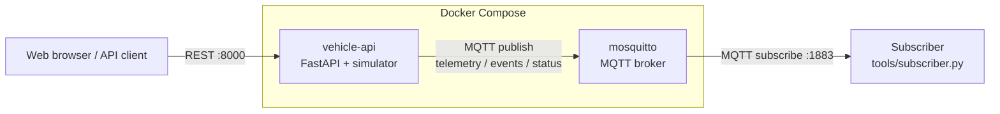

# Vehicle API Simulator

A simple vehicle API simulator built with Python and FastAPI.

This project provides a virtual vehicle environment that exposes vehicle information through REST APIs.

The project is intended for learning and experimentation with:

* Vehicle APIs
* REST APIs
* FastAPI
* Python
* Docker
* MQTT
* Vehicle data simulation
* Middleware and distributed systems

## Architecture



See [docs/architecture.md](docs/architecture.md) for the Docker setup,
components, sequence diagrams and MQTT topics.

## Requirements

* Python 3.9+
* pip
* Git
* Docker (optional)

## Setup

Clone the repository:

```bash
git clone https://github.com/naosyke/vehicle-api-simulator.git
cd vehicle-api-simulator
```

Create a virtual environment:

```bash
python3 -m venv .venv
```

Activate the virtual environment.

### macOS / Linux

```bash
source .venv/bin/activate
```

### Windows PowerShell

```powershell
.venv\Scripts\Activate.ps1
```

Install dependencies:

```bash
pip install -r requirements.txt
```

## Start the Server

Run:

```bash
uvicorn app.main:app --reload
```

The server will start at:

```text
http://127.0.0.1:8000
```

## Run with Docker

Requires [Docker Desktop](https://www.docker.com/products/docker-desktop/) (or Docker Engine with Compose).

Start the simulator:

```bash
docker compose up --build
```

This starts two containers: `vehicle-api` and the `mosquitto` MQTT broker.
The API is available at `http://127.0.0.1:8000` (docs at `/docs`) and the broker at `127.0.0.1:1883`.
Source files under `app/` are mounted into the container and reloaded on change.

Use another host port if 8000 is taken:

```bash
API_PORT=8001 docker compose up --build
```

Run the tests inside the container:

```bash
docker compose exec vehicle-api python -m pytest
```

Stop the simulator:

```bash
docker compose down
```

To build and run the production image without Compose:

```bash
docker build -t vehicle-api-simulator .
docker run --rm -p 8000:8000 vehicle-api-simulator
```

## MQTT

When `MQTT_HOST` is set (as in `docker-compose.yml`), the simulator publishes to an MQTT broker.

| Topic | QoS | Payload |
|---|---|---|
| `vehicle/{vehicle_id}/telemetry` | 0 | Full vehicle state every `TELEMETRY_INTERVAL_SECONDS` |
| `vehicle/{vehicle_id}/events` | 1 | State change events (see below) |
| `vehicle/{vehicle_id}/status` | 1, retained | `online`, or `offline` (also sent as the last will) |

Events:

| Type | Data |
|---|---|
| `vehicle_started` / `vehicle_stopped` | position when stopped |
| `door_opened` / `door_closed` / `door_locked` / `door_unlocked` | `door` |
| `lights_changed` | `headlights`, `hazard` |
| `charging_started` / `charging_stopped` | `battery` |
| `battery_low` (below 20 %) / `battery_empty` | `battery` |
| `simulation_reset` | - |

Example event:

```json
{
  "vehicle_id": "sim-001",
  "timestamp": 1790000000.0,
  "type": "door_opened",
  "data": {"door": "front_left"}
}
```

Watch the messages with the sample subscriber (after `docker compose up`):

```bash
python tools/subscriber.py
```

```text
01:10:09 [sim-001] EVENT vehicle_started
01:10:10 [sim-001] speed=  11.2 km/h  battery=100.00 %  pos=(     1.6,      0.0)  heading=  0.0
01:10:14 [sim-001] EVENT vehicle_stopped x=21.517 y=0.0
01:10:15 [sim-001] EVENT door_opened door=front_left
```

Use `--events-only` to hide telemetry, or `--vehicle sim-001` to filter by vehicle.

The broker configuration in `mosquitto/mosquitto.conf` allows anonymous access and is for local development only.

## API Documentation

FastAPI automatically provides interactive API documentation.

Open:

```text
http://127.0.0.1:8000/docs
```

You can execute API requests directly from the browser.

## Available APIs

All request and response bodies are JSON. Invalid values return `422`, and
commands that are not allowed in the current vehicle state return `409`.

### Vehicle State

| Method | Path | Description |
|---|---|---|
| GET | `/vehicle` | Full vehicle state |
| GET | `/vehicle/speed` | Current and target speed (km/h) |
| POST | `/vehicle/speed` | Set the speed immediately `{"speed": 30}` |
| POST | `/vehicle/target-speed` | Accelerate / decelerate toward a speed `{"speed": 60}` |
| GET / POST | `/vehicle/steering` | Road wheel angle in degrees, -35 to 35, left positive `{"angle": 10}` |
| GET / POST | `/vehicle/position` | Position in meters `{"x": 0, "y": 0}` |
| GET | `/vehicle/doors` | All doors |
| GET / POST | `/vehicle/doors/{door_id}` | `front_left`, `front_right`, `rear_left`, `rear_right` `{"open": true, "locked": false}` |
| GET / POST | `/vehicle/lights` | `{"headlights": "off" \| "low" \| "high", "hazard": false}` |
| GET / POST | `/vehicle/battery` | State of charge in percent `{"level": 80}` |
| POST | `/vehicle/charging` | Start / stop charging `{"charging": true}` |

Example response of `GET /vehicle`:

```json
{
  "speed": 32.7,
  "target_speed": 60.0,
  "battery": 99.9957,
  "charging": false,
  "position": {"x": 13.336, "y": 3.03},
  "heading": 25.6,
  "steering": 5.0,
  "odometer": 0.0138,
  "doors": {
    "front_left": {"open": false, "locked": true},
    "front_right": {"open": false, "locked": true},
    "rear_left": {"open": false, "locked": true},
    "rear_right": {"open": false, "locked": true}
  },
  "lights": {"headlights": "off", "hazard": false}
}
```

### Vehicle Rules

* A locked door cannot be opened (unlock it in the same or an earlier request).
* Doors cannot be opened while the vehicle is moving.
* The vehicle cannot drive with a door open, while charging, or with an empty battery.
* Charging is not allowed while moving and stops automatically at 100 %.
* When the battery reaches 0 %, the vehicle decelerates to a stop.

### Simulation

| Method | Path | Description |
|---|---|---|
| GET | `/simulation` | Whether the periodic update loop is running, tick interval, elapsed time |
| POST | `/simulation/step` | Advance the simulation manually `{"seconds": 1.0}` |
| POST | `/simulation/reset` | Reset the vehicle to its initial state |

The vehicle moves with a kinematic bicycle model:

| Parameter | Value |
|---|---|
| Wheelbase | 2.7 m |
| Acceleration / deceleration | 3.0 / 6.0 m/s² |
| Max speed | 180 km/h |
| Battery | 60 kWh, 0.15 kWh/km, 0.5 kW idle |
| Charging power | 50 kW |

Coordinates: `x` = east, `y` = north, heading 0° = east, counter-clockwise positive.

### Configuration

| Environment variable | Default | Description |
|---|---|---|
| `SIM_AUTO_UPDATE` | `1` | Set to `0` to disable the periodic update loop and use `/simulation/step` only |
| `SIM_TICK_SECONDS` | `0.1` | Periodic update interval in seconds |
| `MQTT_HOST` | (unset) | MQTT broker host. MQTT publishing is disabled when unset |
| `MQTT_PORT` | `1883` | MQTT broker port |
| `VEHICLE_ID` | `sim-001` | Vehicle ID used in MQTT topics |
| `TELEMETRY_INTERVAL_SECONDS` | `1.0` | Telemetry publish interval in seconds |

## Run Tests

Run:

```bash
python -m pytest
```

## Project Structure

```text
vehicle-api-simulator/
│
├── app/
│   ├── __init__.py
│   ├── main.py            # REST API and background loops
│   ├── models.py          # Request / response models
│   ├── mqtt_publisher.py  # MQTT telemetry and events
│   └── simulator.py       # Vehicle state, physics and events
│
├── tests/
│   ├── conftest.py
│   ├── test_main.py
│   ├── test_mqtt_publisher.py
│   └── test_simulator.py
│
├── tools/
│   └── subscriber.py      # Sample MQTT subscriber
│
├── mosquitto/
│   └── mosquitto.conf
│
├── .dockerignore
├── .gitignore
├── Dockerfile
├── docker-compose.yml
├── docs/
│   └── architecture.md
├── README.md
└── requirements.txt
```

## Roadmap

### Phase 1 - REST API

* [x] Basic vehicle API
* [x] Vehicle state model
* [x] API documentation
* [x] Basic tests

### Phase 2 - Vehicle Control

* [x] Change vehicle speed
* [x] Change steering
* [x] Change vehicle position
* [x] Door state
* [x] Lights
* [x] Battery state

### Phase 3 - Vehicle Simulation

* [x] Automatic vehicle movement
* [x] Acceleration / deceleration
* [x] Vehicle physics
* [x] Periodic state updates

### Phase 4 - Docker

* [x] Dockerfile
* [x] Docker Compose
* [x] Containerized development environment

### Phase 5 - MQTT

* [x] MQTT broker
* [x] Vehicle telemetry
* [x] Vehicle event publishing
* [x] Subscriber

### Phase 6 - Dashboard

* [ ] Real-time vehicle monitoring
* [ ] Speed graph
* [ ] Battery graph
* [ ] Position visualization

### Phase 7 - AI

* [ ] Driving data analysis
* [ ] Abnormal behavior detection
* [ ] AI vehicle assistant
* [ ] AI agent integration

## Disclaimer

This project is an independent learning and development project.

It does not contain proprietary source code, specifications, or confidential information from any employer or third party.
