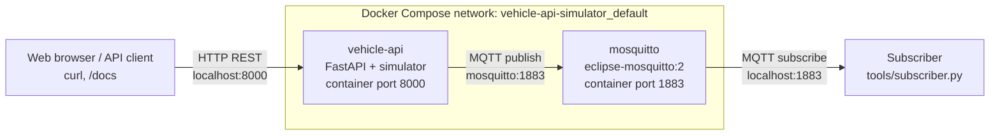
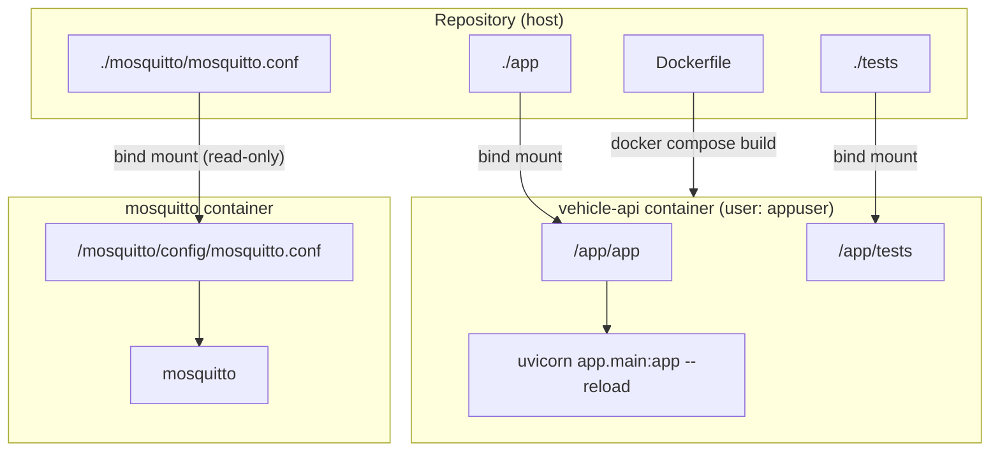
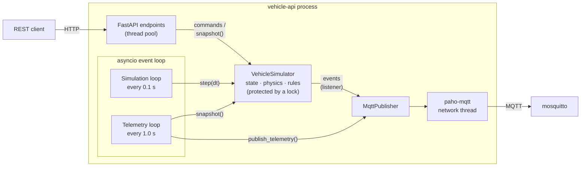
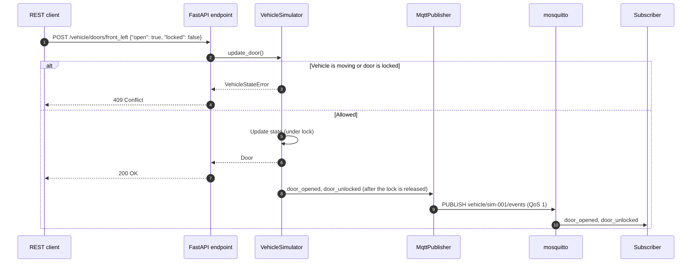
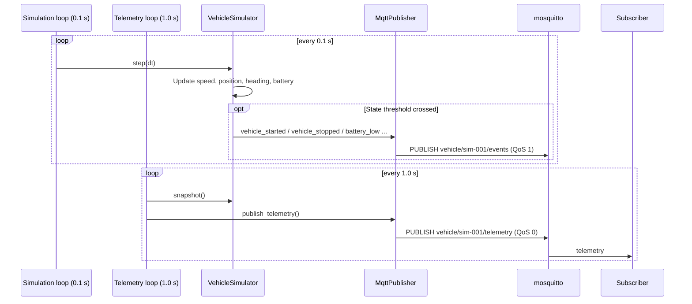
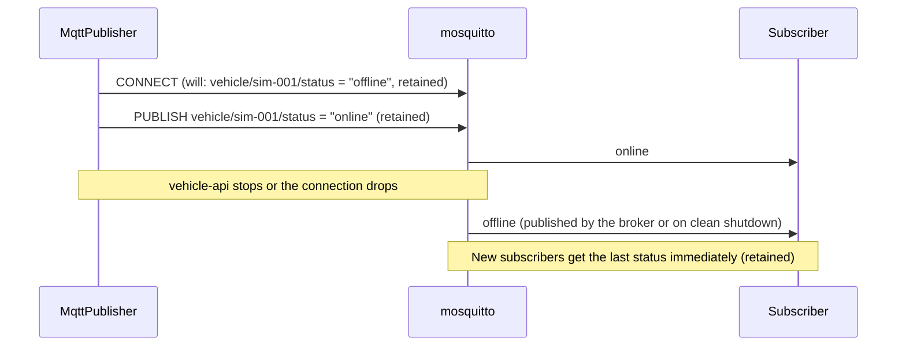

# Architecture

This document describes how the Vehicle API Simulator is deployed with Docker,
how its components communicate, and how data flows through the system.

## 1. System Overview

Two containers run on a Docker Compose network. Clients on the host talk to
the simulator over REST and receive vehicle data from the broker over MQTT.
The host ports shown are the defaults (`API_PORT`, `MQTT_PORT`).

| Container | Image | Role | Host port → container port |
|---|---|---|---|
| `vehicle-api` | Built from `Dockerfile` (python:3.12-slim) | REST API, vehicle simulation, MQTT publisher | `${API_PORT:-8000}` → `8000` |
| `mosquitto` | `eclipse-mosquitto:2` | MQTT broker | `${MQTT_PORT:-1883}` → `1883` |

Inside the Compose network, `vehicle-api` reaches the broker by its service
name (`MQTT_HOST=mosquitto`). Clients on the host use `localhost` and the
published ports.

## 2. Docker Configuration

- `app/` is mounted into the container, and uvicorn reloads it when files change.
- `vehicle-api` starts after `mosquitto` (`depends_on`). It also works if the
  broker becomes available later, because the MQTT client keeps reconnecting.
- The broker allows anonymous connections without TLS. This setup is for local
  development only.

## 3. Components inside vehicle-api

| Component | File | Responsibility |
|---|---|---|
| FastAPI endpoints | `app/main.py` | REST API, validation (`422`), state errors (`409`) |
| Background loops | `app/main.py` | Run the simulation and publish telemetry periodically |
| VehicleSimulator | `app/simulator.py` | Vehicle state, physics, state rules, events |
| MqttPublisher | `app/mqtt_publisher.py` | Send telemetry, events and online/offline status to MQTT |
| Models | `app/models.py` | Request and response schemas |

Thread safety: endpoints run in a thread pool and the loops run on the event
loop, so `VehicleSimulator` protects its state with a lock. Events are
collected while the lock is held and delivered to listeners after it is
released, so a slow listener never blocks the simulation.

## 4. Data Flow

### Command → event → subscriber

### Periodic telemetry

### Connection status (Last Will)

## 5. MQTT Topics

| Topic | Direction | QoS | Retained | Payload |
|---|---|---|---|---|
| `vehicle/{vehicle_id}/telemetry` | simulator → broker | 0 | No | Full vehicle state + `vehicle_id`, `timestamp` |
| `vehicle/{vehicle_id}/events` | simulator → broker | 1 | No | `{"vehicle_id", "timestamp", "type", "data"}` |
| `vehicle/{vehicle_id}/status` | simulator / broker → subscribers | 1 | Yes | `online` or `offline` |

Telemetry uses QoS 0 because a newer sample replaces a lost one. Events use
QoS 1 so that state changes such as `door_opened` are delivered at least once.

Subscribers can use wildcards, for example `vehicle/+/events` for events from
all vehicles.

## 6. Ports and Configuration

| Setting | Default | Where | Description |
|---|---|---|---|
| `API_PORT` | `8000` | host (Compose) | Host port for the REST API |
| `MQTT_PORT` | `1883` | host (Compose) | Host port for the broker |
| `MQTT_PORT` | `1883` | container | Broker port the simulator connects to (set in `docker-compose.yml`) |
| `MQTT_HOST` | unset (`mosquitto` in Compose) | container | Broker host. MQTT is disabled when unset |
| `VEHICLE_ID` | `sim-001` | container | Vehicle ID used in topics |
| `SIM_AUTO_UPDATE` | `1` | container | `0` disables the simulation loop |
| `SIM_TICK_SECONDS` | `0.1` | container | Simulation step interval |
| `TELEMETRY_INTERVAL_SECONDS` | `1.0` | container | Telemetry publish interval |
